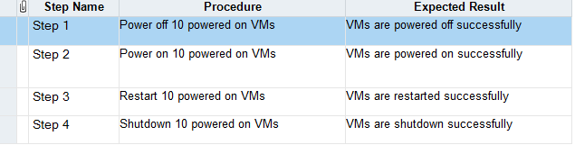

GC:


　　“static方法就是没有this的方法。在static方法内部不能调用非静态方法，反过来是可以的。而且可以在没有创建任何对象的前提下，仅仅通过类本身来调用static方法。这实际上正是static方法的主要用途。”

方便在没有创建对象的情况下来进行调用（方法/变量）

在静态方法中不能访问类的非静态成员变量和非静态成员方法，因为非静态成员方法/变量都是必须依赖具体的对象才能够被调用

　　static变量也称作静态变量，静态变量和非静态变量的区别是：静态变量被所有的对象所共享，在内存中只有一个副本，它当且仅当在类初次加载时会被初始化。而非静态变量是对象所拥有的，在创建对象的时候被初始化，存在多个副本，各个对象拥有的副本互不影响。

static是不允许用来修饰局部变量

this代表当前对象

Test类继承自Base类(Test extends Base)因此会转去先加载Base类，在加载Base类的时候，发现有static块，便执行了static块

在main方法中执行new Test()的时候会先调用父类的构造器，然后再调用自身的构造器。

  new 关键字后面的参数必须是类名，并且类名的后面必须是一组构造方法参数(必须带括号)。

在生成对象的时候，必须先初始化父类的成员变量

spring如何简化java开发


1、最小侵入性编程（不改变别的架构、只会进行扩展）

2、


java enum类型

```java
public enum TemplateStatus {
    READY,
    EXPANDING,
    SHRINKING,
    DELETING,
    INIT,
    ERROR;
}
```

@Override

伪代码,表示重写。(当然不写@Override也可以)，不过写上有如下好处: 
1、可以当注释用,方便阅读；
2、编译器可以给你验证@Override下面的方法名是否是你父类中所有的，如果没有则报错

在重写父类的onCreate时，在方法前面加上@Override 系统可以帮你检查方法的正确性。
@Override
public void onCreate(Bundle savedInstanceState)

{…….}

## maven

mvn clean test:clean表示将你上一次编译生成的一些文件删除，test表示只执行测试代码


## cucumber

直接在resources里，创键file，然后输入.feature，插件自动帮助识别


### lombok

> **@Setter @Getter** ：可以为相应的属性自动生成Getter/Setter方法
>
> 
>
> ### Given
>
> Given一般用于在Scenario中描述系统的**初始状态**。它的目的是使系统在使用前处于一个已只的状态，要避免在Given中谈论交互上的事情。
>
> ### When
>
> When描述**一个事件或者动作**。他可以是与系统间的交互，也可以是由另一个系统触发的事件。cucumber强烈推荐每个Scenario只有一个When，当你觉得需要加更多的When的时候，通常就是需要拆分成多个Scenario的信号。
>
> ### Then
>
> Then描述**期望的输出或者结果**。对Then的step definition应该使用断言去比较期望值和实际值，就和单元测试差不多。
>
> ### But和And
>
> 当有几个Given，When，Then的时候，可以写成
>
> tag提供2个作用
>
> 1. 提供@before和@after的钩子（tagged-hooks）
> 2. 运行时只运行指定tag的用例
>     tag具有继承特性，即在Feature上标记tag，该Feature下的Scenario，step会继承该tag。
>
> **Bean**
>
> 如果采用XML方式来配置的话，Bean定义信息和Bean实现类本身是分离的，而采用注解的方式配置的话，Bean定义的信息即通过在Bean实现类上标注的注解实现。
>
> **Autowired**
>
> 

task



动作

off 

verify

状态 

10 on VMs

