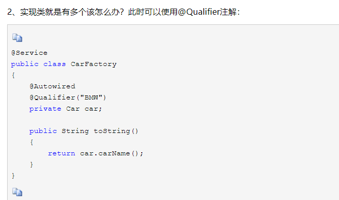
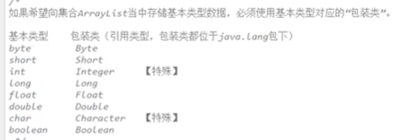
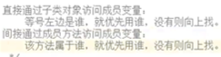

GC:


　　“static方法就是没有this的方法。在static方法内部不能调用非静态方法，反过来是可以的。而且可以在没有创建任何对象的前提下，仅仅通过类本身来调用static方法。这实际上正是static方法的主要用途。”

方便在没有创建对象的情况下来进行调用（方法/变量）

在静态方法中不能访问类的非静态成员变量和非静态成员方法，因为非静态成员方法/变量都是必须依赖具体的对象才能够被调用

　　static变量也称作静态变量，静态变量和非静态变量的区别是：静态变量被所有的对象所共享，在内存中只有一个副本，它当且仅当在类初次加载时会被初始化。而非静态变量是对象所拥有的，在创建对象的时候被初始化，存在多个副本，各个对象拥有的副本互不影响。

static是不允许用来修饰局部变量

this代表当前对象

Test类继承自Base类(Test extends Base)因此会转去先加载Base类，在加载Base类的时候，发现有static块，便执行了static块

在main方法中执行new Test()的时候会先调用父类的构造器，然后再调用自身的构造器。

  new 关键字后面的参数必须是类名，并且类名的后面必须是一组构造方法参数(必须带括号)。

在生成对象的时候，必须先初始化父类的成员变量

spring如何简化java开发


1、最小侵入性编程（不改变别的架构、只会进行扩展）

2、


java enum类型

```java
public enum TemplateStatus {
    READY,
    EXPANDING,
    SHRINKING,
    DELETING,
    INIT,
    ERROR;
}
```

@Override

伪代码,表示重写。(当然不写@Override也可以)，不过写上有如下好处: 
1、可以当注释用,方便阅读；
2、编译器可以给你验证@Override下面的方法名是否是你父类中所有的，如果没有则报错

在重写父类的onCreate时，在方法前面加上@Override 系统可以帮你检查方法的正确性。
@Override
public void onCreate(Bundle savedInstanceState)

{…….}

## maven

mvn clean test:clean表示将你上一次编译生成的一些文件删除，test表示只执行测试代码


## cucumber

直接在resources里，创键file，然后输入.feature，插件自动帮助识别


### lombok

> **@Setter @Getter** ：可以为相应的属性自动生成Getter/Setter方法
>
> 
>
> ### Given
>
> Given一般用于在Scenario中描述系统的**初始状态**。它的目的是使系统在使用前处于一个已只的状态，要避免在Given中谈论交互上的事情。
>
> ### When
>
> When描述**一个事件或者动作**。他可以是与系统间的交互，也可以是由另一个系统触发的事件。cucumber强烈推荐每个Scenario只有一个When，当你觉得需要加更多的When的时候，通常就是需要拆分成多个Scenario的信号。
>
> ### Then
>
> Then描述**期望的输出或者结果**。对Then的step definition应该使用断言去比较期望值和实际值，就和单元测试差不多。
>
> ### But和And
>
> 当有几个Given，When，Then的时候，可以写成
>
> tag提供2个作用
>
> 1. 提供@before和@after的钩子（tagged-hooks）
> 2. 运行时只运行指定tag的用例
>     tag具有继承特性，即在Feature上标记tag，该Feature下的Scenario，step会继承该tag。
>
> **Bean**
>
> 把Bean理解为类的代理或代言人（实际上确实是通过反射、代理来实现的），这样它就能代表类拥有该拥有的东西了(**1、凡是子类及带属性、方法的类都注册Bean到Spring中，交给它管理；**
>
> **2、@Bean 用在方法上，告诉Spring容器，你可以从下面这个方法中拿到一个Bean**)
>
> 如果采用XML方式来配置的话，Bean定义信息和Bean实现类本身是分离的，而采用注解的方式配置的话，Bean定义的信息即通过在Bean实现类上标注的注解实现。
>
> **Autowired**
>
> **Spring**
>
> Spring framework is [divided into modules](https://docs.spring.io/spring/docs/current/spring-framework-reference/index.html) which makes it really easy to pick and choose in parts to use in any application:
>
> - [Core](https://docs.spring.io/spring/docs/5.1.8.RELEASE/spring-framework-reference/core.html#spring-core): Provides core features like DI (Dependency Injection), Internationalisation, Validation, and AOP (Aspect Oriented Programming)
> - [Data Access](https://docs.spring.io/spring/docs/5.1.8.RELEASE/spring-framework-reference/data-access.html#spring-data-tier): Supports data access through JTA (Java Transaction API), JPA (Java Persistence API), and JDBC (Java Database Connectivity)
> - [Web](https://docs.spring.io/spring/docs/5.1.8.RELEASE/spring-framework-reference/web.html#spring-web): Supports both Servlet API ([Spring MVC](https://docs.spring.io/spring/docs/5.1.8.RELEASE/spring-framework-reference/web.html#spring-web)) and of recently Reactive API ([Spring WebFlux](https://docs.spring.io/spring/docs/5.1.8.RELEASE/spring-framework-reference/web-reactive.html#spring-webflux)), and additionally supports WebSockets, STOMP, and WebClient
> - [Integration](https://docs.spring.io/spring/docs/5.1.8.RELEASE/spring-framework-reference/integration.html#spring-integration): Supports integration to Enterprise Java through JMS (Java Message Service), JMX (Java Management Extension), and RMI (Remote Method Invocation)
> - [Testing](https://docs.spring.io/spring/docs/5.1.8.RELEASE/spring-framework-reference/testing.html#testing): Wide support for unit and integration testing through Mock Objects, Test Fixtures, Context Management, and Caching
>
> 
>
> @Autowired顾名思义，就是自动装配，其作用是为了消除代码Java代码里面的getter/setter与bean属性中的property。当然，getter看个人需求，如果私有属性需要对外提供的话，应当予以保留。
>
> 
>
> 
>
> @Lazy improve construction speed,object not call constructor
>
> @Primary has considered priority 


## Javafx

Pair类在javafx.util 包中，类构造函数有两个参数，键及对应值：

    Pair<Integer, String> pair = new Pair<>(1, "One");
    Integer key = pair.getKey();
    String value = pair.getValue();
## Java普通知识

List  集合 []

import java.util.List

import java.util.ArrayList

List list1 new ArrayList();

void list.add(int index,E element);

Boolean addAll(int index, Collection);

Boolean b = list1.addAll(2, list2)

```
List<String> results = new ArrayList<>();
```

指定object为String

Java Object 类是所有类的父类，也就是说 Java 的所有类都继承了 Object，**子类可以使用 Object 的所有方法**。

Stack<Integer> st = new Stack<Integer>()

 st.push(new Integer(a));

st.pop();


this 关键字用来表示当前对象本身，或当前类的一个实例


hashset.add(E e)：返回boolean型，如果此 set 中尚未包含指定元素，则添加指定元素；如果此 set 已包含该元素，则该调用不更改 set 并返回 false。


String[][] str = {{"a0","a1"},{"b0","b1"}};


import java.lang.management.ThreadMXBean;

ThreadMXBean threadMXBean = ManagementFactory.getThreadMXBean(); //返回 Java 虚拟机的线程系统的管理 Bean。

threadMXBean.getCurrentThreadCpuTime() 返回当前线程的总CPU时间（纳秒）。返回值的精度为纳秒，但不一定是纳秒。如果实现区分用户模式时间和系统模式时间，则返回的CPU时间是当前线程在用户模式或系统模式下执行的时间量。

Java虚拟机实现可能支持测量当前线程、任何线程或无线程的CPU时间。

```
threadMXBean.getCurrentThreadUserTime()
```

the user-level CPU time for the current thread if CPU time measurement is enabled

### 向枚举添加新方法

`public enum Color {  
    RED("红色", 1), GREEN("绿色", 2), BLANK("白色", 3), YELLO("黄色", 4);  
    // 成员变量  
    private String name;  
    private int index;  
    // 构造方法  
    private Color(String name, int index) {  
        this.name = name;  
        this.index = index;  
    }  
    // 普通方法  
    public static String getName(int index) {  
        for (Color c : Color.values()) {  
            if (c.getIndex() == index) {  
                return c.name;  
            }  
        }  
        return null;  
    }  
    // get set 方法  
    public String getName() {  
        return name;  
    }  
    public void setName(String name) {  
        this.name = name;  
    }  
    public int getIndex() {  
        return index;  
    }  
    public void setIndex(int index) {  
        this.index = index;  
    }  
}`

HashMap< String, String> hMap = 
      new HashMap< String, String>();
      hMap.put("1", "1st");
      hMap.put("2", "2nd");
      hMap.put("3", "3rd");
      Collection cl = hMap.values();
      Iterator itr = cl.iterator();
      while (itr.hasNext()) {
         System.out.println(itr.next());

}

java collection和set 两种基本集合

//Todo 其实就是类似于标记的作用，可以很快的定位到这个位置，方便查找，如图：


BufferedReader reader

```
reader = new BufferedReader(new FileReader(file));
```

trim() 方法用于删除字符串的头尾空白符。


valueof 定参数的原生 Number 对象值，参数可以是原生数据类型, String等

​        Float a = Float.valueOf("80");        

set.retainAll(collection) #保留同集

```
println 会有换行效果
```

```
-> 匿名函数
```

返回参与比较的前后两个字符串的ASCII码的差值，如果两个字符串首字母不同，则该方法返回首字母的ASCII码的差值。
String a1 = "a";
String a2 = "c";        
System.out.println(a1.compareTo(a2));//结果为-2

 () -> {System.out.println("hello");}  就是传说中的lambda表达式，等同于上面的new Runnable(), lambda大体分为3部分：

     1.最前面的部分是一对括号，里面是参数，这里无参数，就是一对空括号
    
     2.中间的是 -> ，用来分割参数和body部分
    
     3.是body部分，可以是一个表达式或者一个语句块。如果是一个表达式，表达式的值会被作为返回值返回；如果是语句块，需要用return语句指定返回值。
```java
System.out.println(3>2?"A":"B");//输出A
```

final修饰的变量必须初始化，且一旦初始化后不能再被修改

```
final类不能被继承，因此final类的成员方法没有机会被覆盖，默认都是final的。在设计类时候，如果这个类不需要有子类，类的实现细节不允许改变，并且确信这个类不会再被扩展，那么就设计为final类。 final方法不能被子类的方法覆盖，但可以被继承。 
```

**被static关键字修饰的不需要创建对象去调用，直接根据类名就可以去访问。**


在静态方法中不能访问类的非静态成员变量和非静态成员方法，因为**非静态成员方法/变量都是必须依赖具体的对象**才能够被调用

非静态成员方法中是可以访问静态成员方法/变量的

静态变量被**所有的对象**所共享，在**内存中只有一个副本**，它当且仅当在**类初次加载**时会被初始化。而非静态变量是对象所拥有的，在**创建对象的时候被初始化**，存在**多个**副本，各个对象拥有的副本互不影响。

enum比较用==，不用equals，会出现空指针情况。


java普通知识、java ajax、java spring、java ssm


标识符==自定义变量、英文字母+数字+$+_ 

类名：首字母大写 变量名、方法名：首字母小写


javac：是编译命令，将**java源文件**编译成**.class**字节码文件。

java：是运行**字节码**文件；由**java虚拟机**对**字节码**进行解释和运行。

隐性转换：可以小转换成大的


valueOf() 方法用于返回给定参数的原生 Number 对象值，参数可以是原生数据类型, String等。该方法是静态方法

Float a = Float.valueOf("80");        

Integer b = Integer.valueOf("444",16);  *// 使用 16 进制*

(a=80.0 b=1092)

SimpleDateFormat s = new SimpleDateFormat("yyyy-MM-dd");

在main方法中执行new Test()的时候会先调用父类的构造器，然后再调用自身的构造器。

**byte：**

- byte 数据类型是8位、有符号的，以二进制补码表示的整数；
- 最小值是 **-128（-2^7）**；
- 最大值是 **127（2^7-1）**；
- 默认值是 **0**；
- byte 类型用在大型数组中节约空间，主要代替整数，因为 byte 变量占用的空间只有 int 类型的四分之一；

short 16 int 32 long 64(eg: 1000L) float 32(100f)


int num = (int) 3.5   => num = 3向下取整

short/byte/char在运算时会自动转换成int，如果要换回原始ds=》强制转换。


三元运算符：int max = a>b ? a : b

switch (case):

case 1:

break:

default:

break;

do{

}while (condition);


数组基本创建方法

int[] array = new int[300]; capacity = 300

String[] array = new String[] {"H","I","J"};capacity = 3 

int[] array = {3,4,5};capacity = 3 ,omitting format/abbreviation


Student s = new Student();

difference between object and instance: object: s, and s is an instance of Class Student.


Java内存的部分：1.Stack, local parameter. **method running should be in Stack**

2.Heap: object(all have default value) 3. Method area(save .class info)4.Native method Stack:relate to OS

5.pc Register: relate to CPU


int[] arrayA = arrayB;  Assign the address of  arrayB to arrayA;  eg: all equal to 0x666

get array length:  arrayA.length

Method input/return parameter is passing the parameter address

ood: using encapsulated method


this.成员变量名 =》用于区分


Constructor(method) can be overload.


alt+insert: in ideal can insert constructor, Setter and Setter automatically

```java
Scanner scanner = new Scanner(System.in);//keyboard input
int i = scanner.nextInt();//get int num
String j = scanner.next();//get int num
```

ArrayList size is changing.


boolean success = ArrayList.add(E);add Element in tail location,return result

ArrayList.get(int index)/ .remove(int index)/ .size() == int[].length



String cannot be changed


compare value => "abc".equals(str1) //str1="abc"

String length : "asdsada".length()

str1+str2 = str1.concat(str2)

str1.charAt(index) //get index loc char

str1.indexOf(String str2)// get str2 loc found in str1, if not exist return -1

str1.substring(int begin,int end)//return str1's substring [begin,end)

str1.substring(int index); return str start from index to end


str1.toCharArray() //return str1's Char Array format

str1.getBytes()//return Bytes Array fotmat

str2 = str1.replace(oldstr,newstr)//str1 never change, will return new one

String[] array = str1.split(",") // "aaa,bbb"	=>	return ["aaa","bbb"] if ","not exist return all


static method can be called by class

static cannot visit non static, because in memory generate static  before generating non static

Arrays.sort(array1) //ascending 

ceil(double num)//round up

floor(double num)//round down

round(double num)//rounding



super.num // father class member parameter

@Override //aim to examine the method is override correctly

child class override method return value field < father class method （permission relationship is same format）

sequence: 1.run father class constructor2. run child class constructor(will run default super.constructor)


string[] str_all = {" "," "}

Arrays.sort(str_all,) #public static void sort(int[] arr, int from_Index, int to_Index), 

```
from_Index - the index of the first element, inclusive, to be sorted
to_Index - the index of the last element, exclusive, to be sorted
```

ascending order.

```java
Arrays.sort(array, Collections.reverseOrder());
```

Integer[] can do this, Integer is an Object.