1、svn类似git 版本控制系统

SVN与GIT的区别：

1.GIT是分布式的，而SVN是集中式的

2.GIT把内容按元数据方式存储，而SVN是按文件：因为git目录是处于个人机器上的一个克隆版的版本库，它拥有中心版本库上所有的东西，例如标签，分支，版本记录等。

3.GIT分支和SVN的分支不同：svn会发生分支遗漏的情况，而git可以同一个工作目录下快速的在几个分支间切换，很容易发现未被合并的分支，简单而快捷的合并这些文件。

4.GIT没有一个全局的版本号，而SVN有

5.GIT的内容完整性要优于SVN：GIT的内容存储使用的是SHA-1哈希算法。这能确保代码内容的完整性，确保在遇到磁盘故障和网络问题时降低对版本库的破坏。

6.svn能进行权限控制，svn也不用全部clone，gti一旦更新完了就要全clone下来。

## 集中式和分布式的区别：

集中式版本控制系统：版本库是集中存放在中央服务器的，而干活的时候，用的都是自己的电脑，所以要先从中央服务器取得最新的版本，然后开始干活，干完活了，再把自己的活推送给中央服务器。集中式版本控制系统最大的毛病就是必须联网才能工作。

分布式版本控制系统：分布式版本控制系统根本没有“中央服务器”，每个人的电脑上都是一个完整的版本库，这样，你工作的时候，就不需要联网了，因为版本库就在你自己的电脑上。比方说你在自己电脑上改了文件A，你的同事也在他的电脑上改了文件A，这时，你们俩之间只需把各自的修改推送给对方，就可以互相看到对方的修改了。

svn subversion

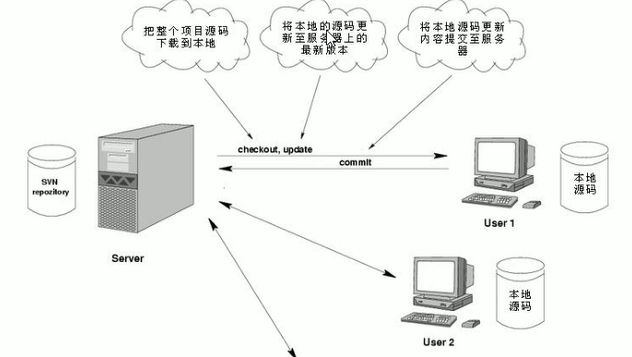

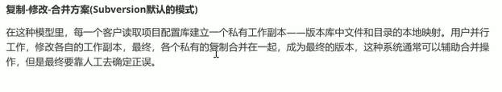

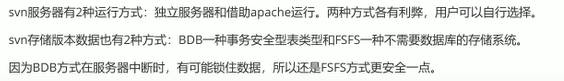

win下 svn服务器visualSVN，客户端tortoiseSVN，idea svn插件

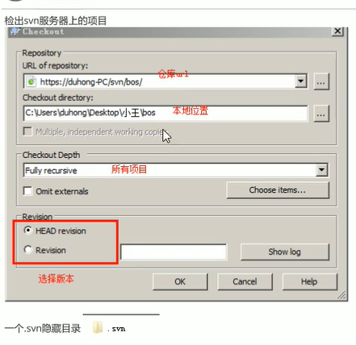

切换版本show log，然后update item 

在最新版前做改动，使用revert，update不会修改你在最新版前的改动

exporter不受版本控制就是将整个项目导出

### 版本冲突

多个用户对同一文件进行修改

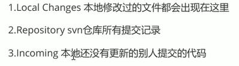

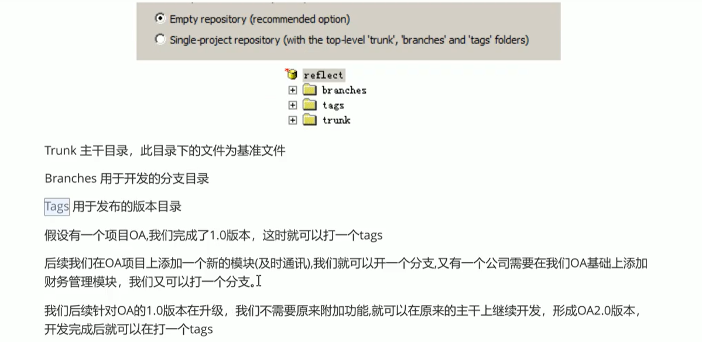

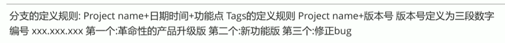

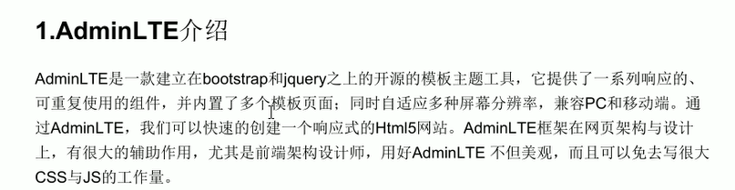


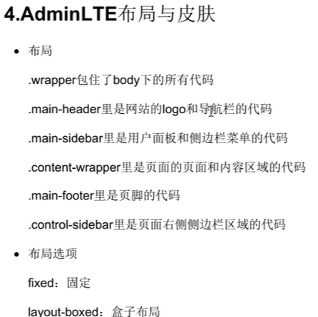

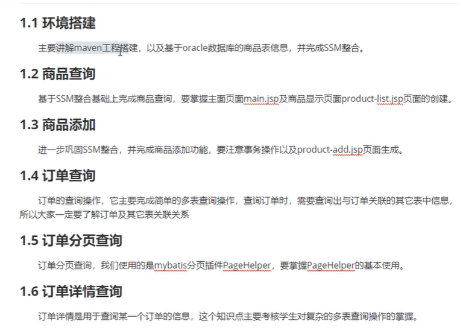


SSM（Spring+SpringMVC+MyBatis）框架集由Spring、MyBatis两个开源框架整合而成（SpringMVC是Spring中的部分内容）。常作为数据源较简单的web项目的框架。

https://blog.csdn.net/qq_37651267/article/details/93358647

表现层 SpringMVC 和浏览器交互、业务层Spring框架 业务逻辑、持久层 MyBatis 和DB交互

整合用配置文件+注解

Spring是一个轻量级的控制反转（IoC）和面向切面（AOP）的容器框架

MyBatis 使用简单的 XML或注解用于配置和原始映射，将接口和 Java 的POJOs（Plain Old Java Objects，普通的 Java对象）映射成数据库中的记录。

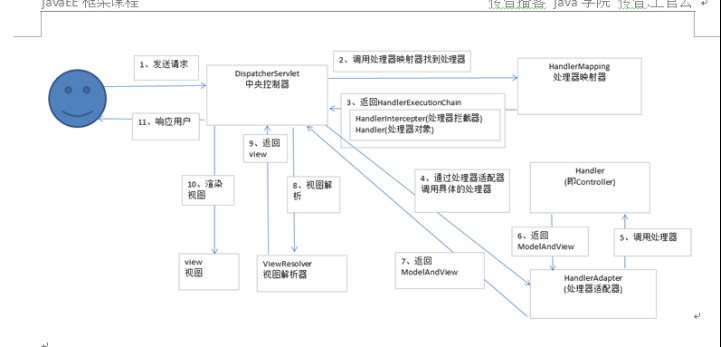

1. SpringMVC的工作流程?

```
1. 用户发送请求至前端控制器DispatcherServlet
2. DispatcherServlet收到请求调用HandlerMapping处理器映射器。
3. 处理器映射器根据请求url找到具体的处理器，生成处理器对象及处理器拦截器(如果有则生成)一并返回给DispatcherServlet。
4. DispatcherServlet通过HandlerAdapter处理器适配器调用处理器
5. 执行处理器(Controller，也叫后端控制器)。
6. Controller执行完成返回ModelAndView
7. HandlerAdapter将controller执行结果ModelAndView返回给DispatcherServlet
8. DispatcherServlet将ModelAndView传给ViewReslover视图解析器
9. ViewReslover解析后返回具体View
10. DispatcherServlet对View进行渲染视图（即将模型数据填充至视图中）。
11. DispatcherServlet响应用户
```

Oracle 关系型db

**项目构建，管理，jar包下载，现在发现了一个很有趣的功能，下载source并关联source**

@Autowired 注释，它可以对类成员变量、方法及构造函数进行标注，完成自动装配的工作。 通过 @Autowired的使用来消除 set ，get方法。